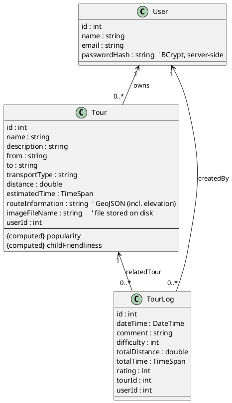
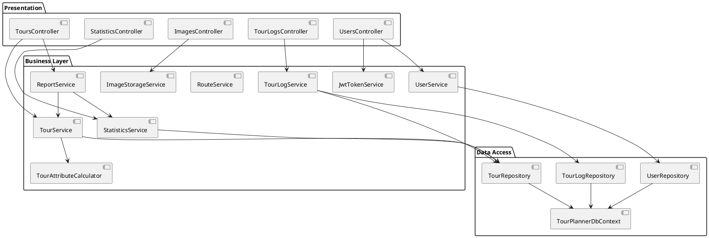
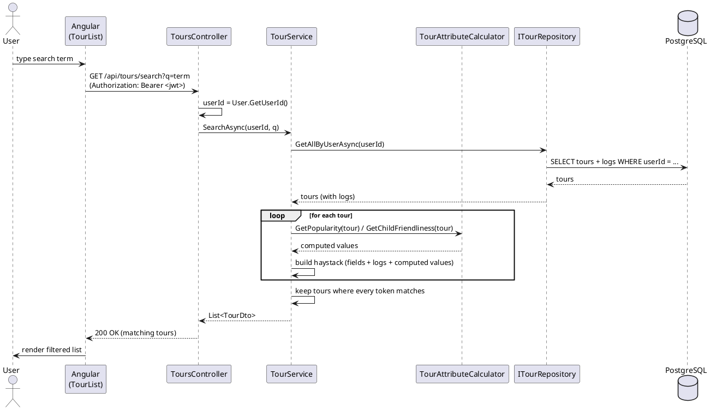

# UML

## Class diagram (domain model)

## Layer / component diagram

## Sequence diagram — full-text search

> The PNG exports (`UML Diagramm.png`, `UseCase Diagramm.png`) can be regenerated from these PlantUML
> sources; the class diagram PNG should be refreshed to include `imageFileName` and `TourLog.userId`.
